# Bibliothèque Numérique - Frontend Angular

Application frontend Angular pour la gestion d'une bibliothèque numérique.

## 📋 Prérequis

- Node.js 18+ et npm
- Angular CLI 17+
- MongoDB Community Server - [Télécharger MongoDB Community Edition](https://www.mongodb.com/try/download/community)
- MongoDB Compass (optionnel, pour visualiser la base de données) - [Télécharger MongoDB Compass](https://www.mongodb.com/try/download/compass)

## 🚀 Installation

1. **Installer Angular CLI globalement (si ce n'est pas déjà fait)**
   ```bash
   npm install -g @angular/cli
   ```

2. **Naviguer vers le dossier frontend**
   ```bash
   cd Angular-frontend
   ```

3. **Installer les dépendances**
   ```bash
   npm install
   ```

4. **Configurer l'URL de l'API**
   
   Modifier le fichier `src/environments/environment.ts` si nécessaire :
   ```typescript
   export const environment = {
     production: false,
     apiUrl: 'http://localhost:5000/api'
   };
   ```

## 🏃 Exécution

```bash
npm start
# Ou bien via la commande ng 
ng serve
```

L'application sera accessible sur `http://localhost:4200`

Pour une version de production :
```bash
npm run build
# Ou bien via la commande ng 
ng build
```

## 📁 Structure du Projet

```
Angular-frontend/
├── src/
│   ├── app/
│   │   ├── components/          # Composants réutilisables
│   │   │   └── navbar/
│   │   ├── guards/              # Guards de routage
│   │   │   ├── auth.guard.ts
│   │   │   └── admin.guard.ts
│   │   ├── pages/               # Pages de l'application
│   │   │   ├── login-page/
│   │   │   ├── register-page/
│   │   │   ├── books-page/
│   │   │   ├── book-detail-page/
│   │   │   ├── reservations-page/
│   │   │   ├── borrows-page/
│   │   │   └── admin-page/
│   │   ├── services/            # Services pour les appels API
│   │   │   ├── auth.service.ts
│   │   │   ├── book.service.ts
│   │   │   ├── reservation.service.ts
│   │   │   └── borrow.service.ts
│   │   ├── app.component.ts
│   │   └── app.routes.ts
│   ├── environments/
│   │   └── environment.ts
│   ├── index.html
│   ├── main.ts
│   └── styles.css
├── angular.json
├── package.json
└── tsconfig.json
```

## 🎯 Fonctionnalités

### Pages disponibles

- **Login** (`/login`) - Connexion des utilisateurs
- **Register** (`/register`) - Inscription de nouveaux utilisateurs
- **Books** (`/books`) - Liste des livres avec recherche et filtres
- **Book Detail** (`/books/:id`) - Détails d'un livre, réservation et emprunt
- **Reservations** (`/reservations`) - Liste des réservations de l'utilisateur
- **Borrows** (`/borrows`) - Liste des emprunts de l'utilisateur
- **Admin** (`/admin`) - Gestion des livres (admin seulement)

### Services

- **AuthService** - Gestion de l'authentification et des tokens JWT
- **BookService** - Gestion des livres (CRUD)
- **ReservationService** - Gestion des réservations
- **BorrowService** - Gestion des emprunts

### Guards

- **authGuard** - Protège les routes nécessitant une authentification
- **adminGuard** - Protège les routes réservées aux administrateurs

## 🔐 Authentification

L'application utilise JWT pour l'authentification. Le token est stocké dans le localStorage et inclus automatiquement dans les requêtes HTTP.

## 🎨 Interface

L'interface est responsive et utilise un design moderne avec :
- Navigation bar en haut
- Cartes pour afficher les informations
- Tableaux pour les listes
- Formulaires pour les actions

## 📸 Captures d'écran

### Page de connexion

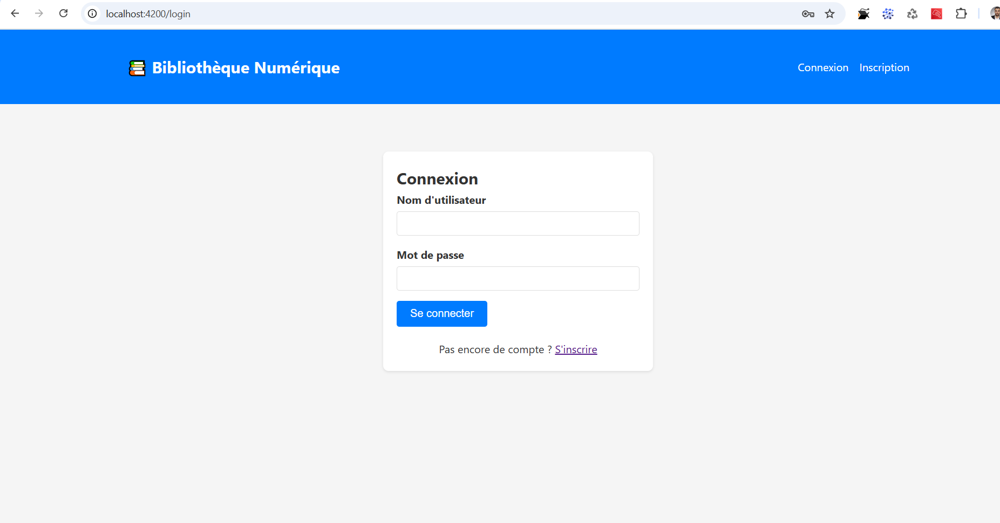

### Page d'inscription

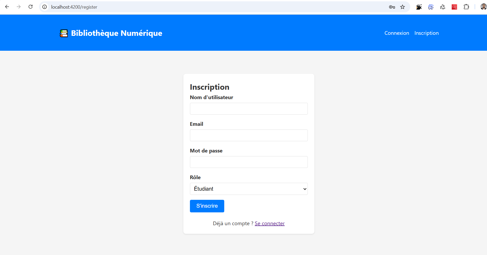

### Tableau de bord administrateur

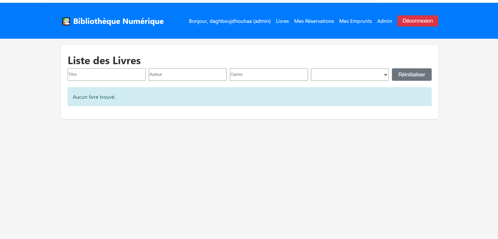

### Message d'erreur de connexion

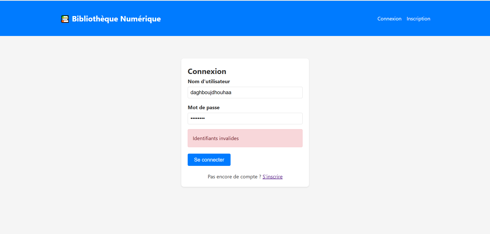

### Ajout d'un livre (Admin)

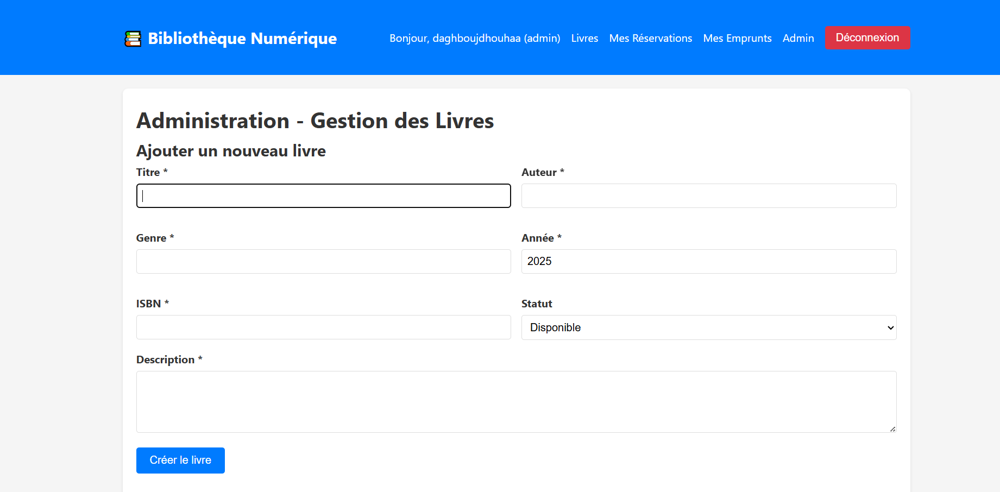

### Liste des livres (Admin)

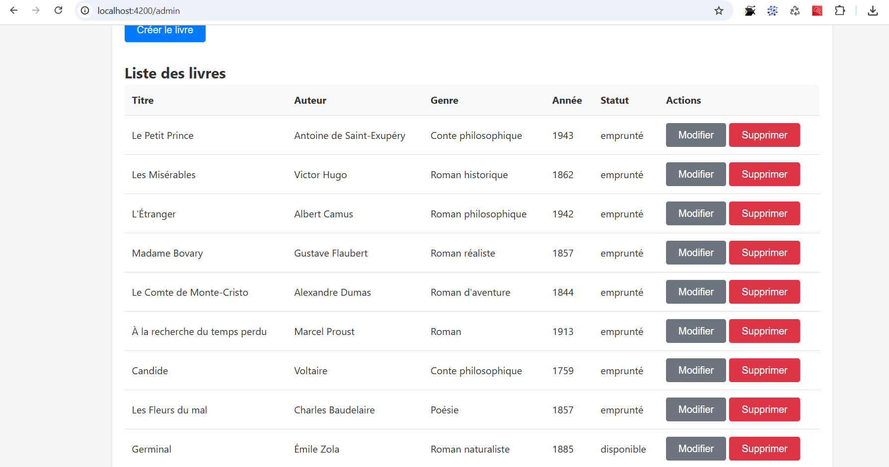


### Mise à jour d'un livre (Admin)

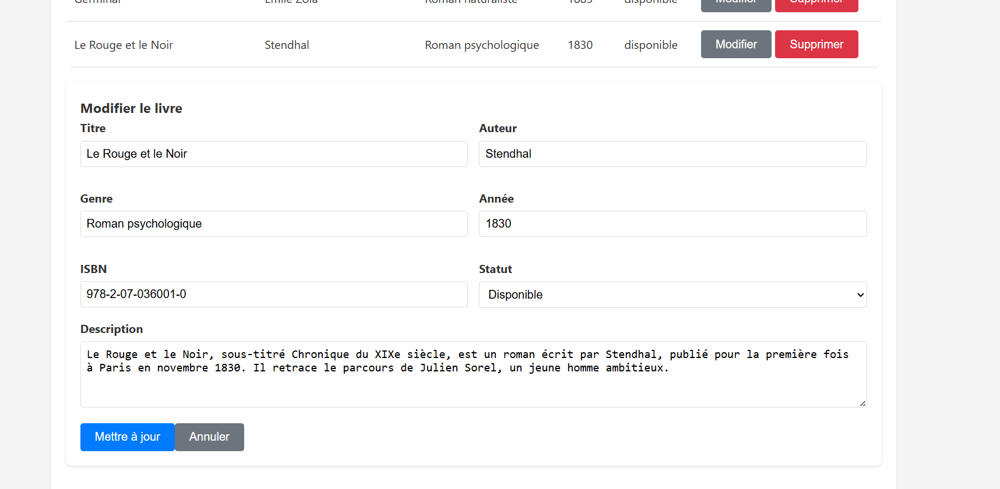

### Confirmation de suppression d'un livre (Admin)

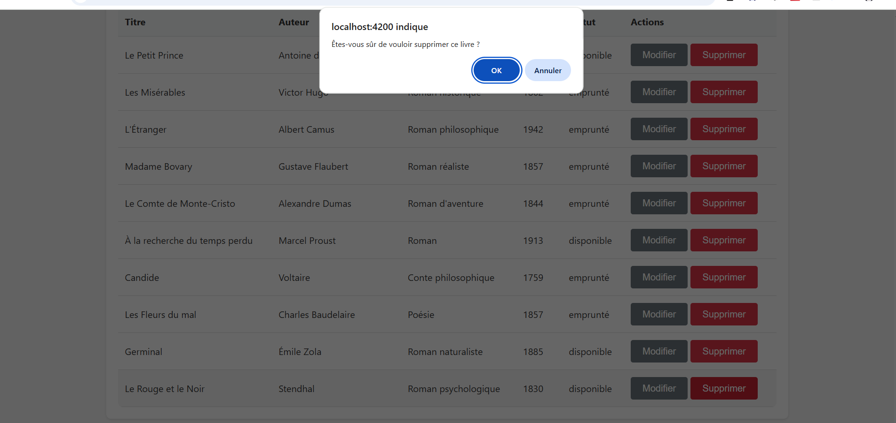

### Page de retour de livre

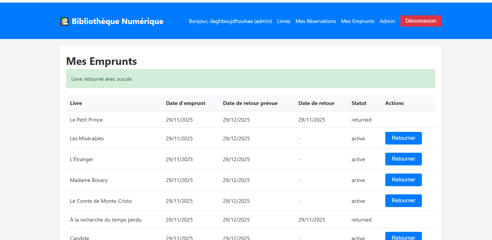


### Mes emprunts


### Liste des livres (Étudiant)

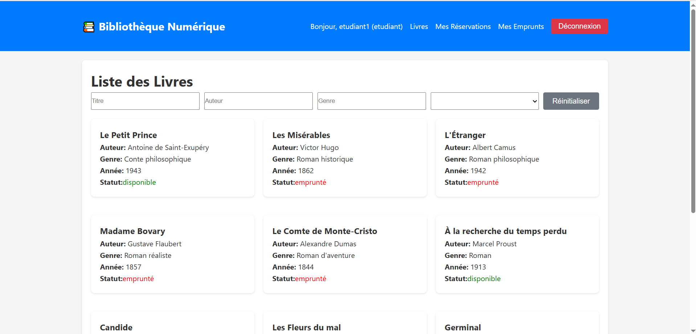

### Détails d'un livre (Étudiant)

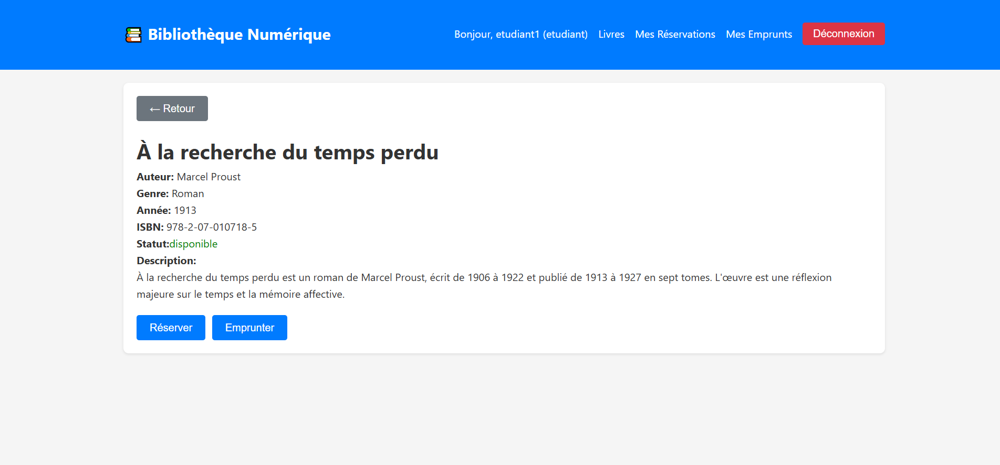

### Livre réservé (Étudiant)

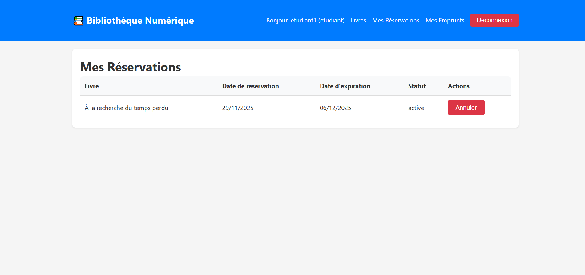

### Mes emprunts (Étudiant)

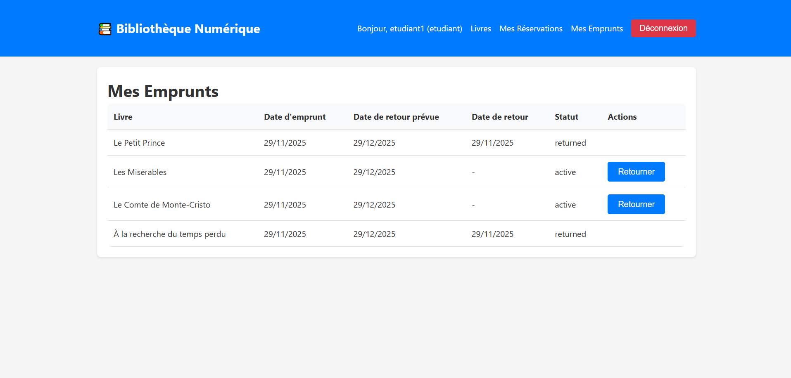

### Détails d'un livre déjà emprunté (Étudiant)

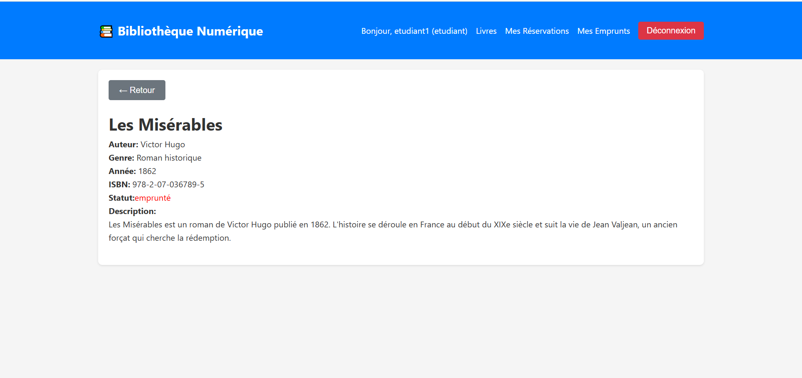

### Tableau de bord enseignant

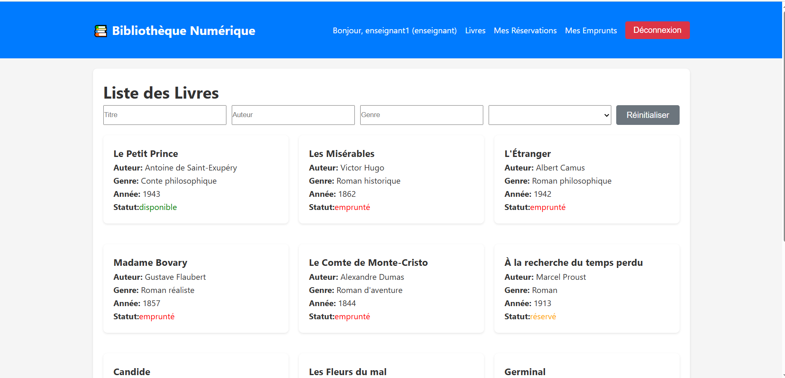

## 🛠️ Technologies Utilisées

- **Angular 17** : Framework frontend
- **TypeScript** : Langage de programmation
- **RxJS** : Programmation réactive
- **Angular Router** : Navigation
- **Angular Forms** : Gestion des formulaires
- **HTTP Client** : Appels API

## 📝 Notes

- Assurez-vous que le backend Flask est en cours d'exécution avant de démarrer l'application frontend
- L'URL de l'API peut être modifiée dans `src/environments/environment.ts`
- Pour la production, créez un fichier `environment.prod.ts` avec les configurations appropriées

## 📄 Licence

Ce projet est développé dans le cadre d'un projet académique.

